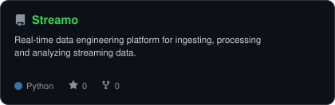
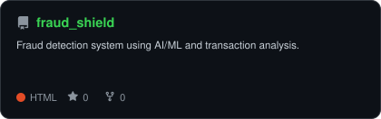
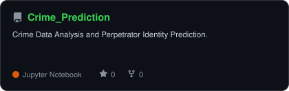
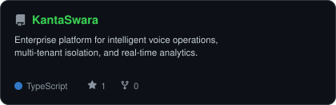

<div align="center">

<!-- PORTRAIT - Add your portrait to assets/jacket.png and regenerate with:
       python scripts/dotify.py assets/jacket.png -o assets/portrait \
         --cols 100 --equalize --detail 0.5 --color -->


<br>

<!-- NAME / TAGLINE - animated typing -->
<a href="https://github.com/Mani2815">
  
</a>

<br>

<!-- SOCIALS -->
<a href="https://linkedin.com/in/YOUR_LINKEDIN"></a>
<a href="mailto:YOUR_EMAIL"></a>
<a href="https://YOUR_PORTFOLIO_URL"></a>
<a href="https://leetcode.com/u/YOUR_LEETCODE"></a>


</div>

---

## `~/` whoami

```console
$ cat about.txt
```

Hi, I'm **Maniarasan J**. I am an MCA student at CHRIST University with a background in Computer Science and Data Analytics.
I specialize in building practical systems around data engineering and AI/ML.

- Currently exploring **data engineering and AI/ML systems**
- Building projects around **data pipelines, analytics and intelligent applications**
- Working with **Python, SQL, cloud and modern data tooling**
- Interested in **scalable and production-oriented systems**

<br>

<div align="center">

## `~/` toolbox


</div>

---

<div align="center">

## `~/` skill radar

<table>
<tr>
<td width="50%" align="center" valign="middle">

<!-- Self-rated radar - edit assets/skills.json, the workflow redraws it -->
<picture>
  <source media="(prefers-color-scheme: dark)"  srcset="assets/radar-dark.svg">
  <source media="(prefers-color-scheme: light)" srcset="assets/radar-light.svg">
  
</picture>

</td>
<td width="50%" align="center" valign="middle">

<!-- Live radar built from real language byte counts across your repos -->
<picture>
  <source media="(prefers-color-scheme: dark)"  srcset="assets/radar-langs-dark.svg">
  <source media="(prefers-color-scheme: light)" srcset="assets/radar-langs-light.svg">
  
</picture>

</td>
</tr>
</table>

</div>

---

<div align="center">

## `~/` contribution calendar

<!-- 3D isometric calendar, regenerated every 6h by .github/workflows/metrics.yml -->


<br><br>

<!-- Snake eats the contribution graph - .github/workflows/snake.yml -->
<picture>
  <source media="(prefers-color-scheme: dark)"  srcset="https://raw.githubusercontent.com/Mani2815/Mani2815/output/snake-dark.svg">
  <source media="(prefers-color-scheme: light)" srcset="https://raw.githubusercontent.com/Mani2815/Mani2815/output/snake.svg">
  
</picture>

</div>

---

<div align="center">

## `~/` the numbers

<!-- Generated by scripts/cards.py into this repo. Deliberately NOT
     github-readme-stats / streak-stats / github-profile-trophy: those are
     shared public instances that go down and take the whole section with them. -->
<picture>
  <source media="(prefers-color-scheme: dark)"  srcset="assets/card-stats-dark.svg">
  <source media="(prefers-color-scheme: light)" srcset="assets/card-stats-light.svg">
  
</picture>

<br>


<br><br>


</div>

---

<div align="center">

## `~/` selected work

<!-- Cards generated by scripts/cards.py from assets/projects.json.
     Stars, forks and language are pulled live from the API on every run. -->
<table>
<tr>
<td width="50%">
  <a href="https://github.com/Mani2815/Streamo">
    <picture>
      <source media="(prefers-color-scheme: dark)"  srcset="assets/card-Streamo-dark.svg">
      <source media="(prefers-color-scheme: light)" srcset="assets/card-Streamo-light.svg">
      
    </picture>
  </a>
</td>
<td width="50%">
  <a href="https://github.com/Mani2815/fraud_shield">
    <picture>
      <source media="(prefers-color-scheme: dark)"  srcset="assets/card-fraud_shield-dark.svg">
      <source media="(prefers-color-scheme: light)" srcset="assets/card-fraud_shield-light.svg">
      
    </picture>
  </a>
</td>
</tr>
<tr>
<td width="50%">
  <a href="https://github.com/Mani2815/Crime_Prediction">
    <picture>
      <source media="(prefers-color-scheme: dark)"  srcset="assets/card-Crime_Prediction-dark.svg">
      <source media="(prefers-color-scheme: light)" srcset="assets/card-Crime_Prediction-light.svg">
      
    </picture>
  </a>
</td>
<td width="50%">
  <a href="https://github.com/Mani2815/KantaSwara">
    <picture>
      <source media="(prefers-color-scheme: dark)"  srcset="assets/card-KantaSwara-dark.svg">
      <source media="(prefers-color-scheme: light)" srcset="assets/card-KantaSwara-light.svg">
      
    </picture>
  </a>
</td>
</tr>
</table>

<sub>

| project | live | stack |
|---|---|---|
| **[Streamo](https://github.com/Mani2815/Streamo)** | https://streamo-xbeu.onrender.com | `Data Engineering` |
| **[fraud_shield](https://github.com/Mani2815/fraud_shield)** | https://fraud-sheild-hvkg.onrender.com | `AI/ML` |
| **[Crime_Prediction](https://github.com/Mani2815/Crime_Prediction)** | https://crimeprediction-production.up.railway.app | `Analytics` |
| **[KantaSwara](https://github.com/Mani2815/KantaSwara)** | https://kantaswara.vercel.app | `Analytics` `AI/ML` |

</sub>

</div>

---

<div align="center">

<sub>`01101011 01100101 01100101 01110000 00100000 01100010 01110101 01101001 01101100 01100100 01101001 01101110 01100111`</sub>

</div>
